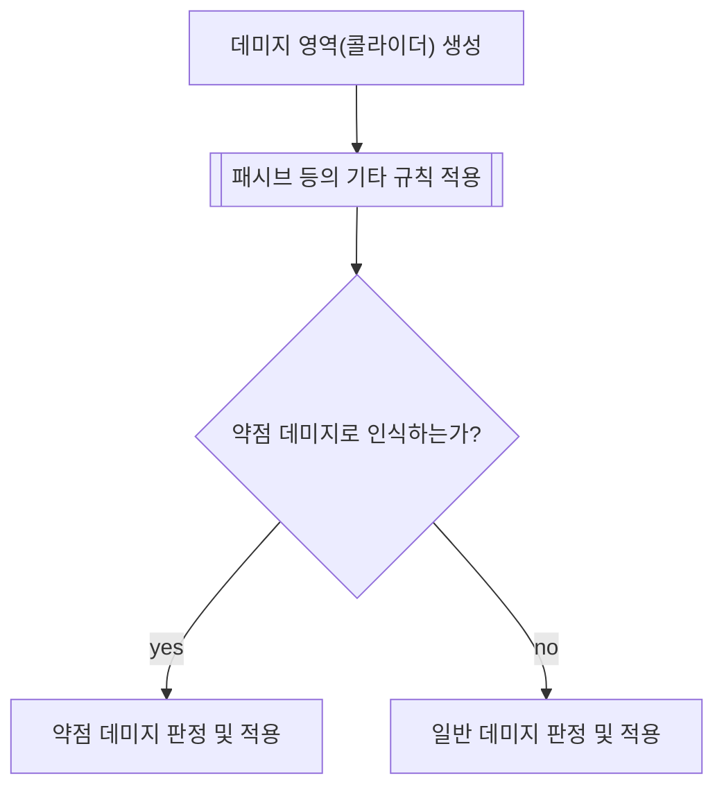
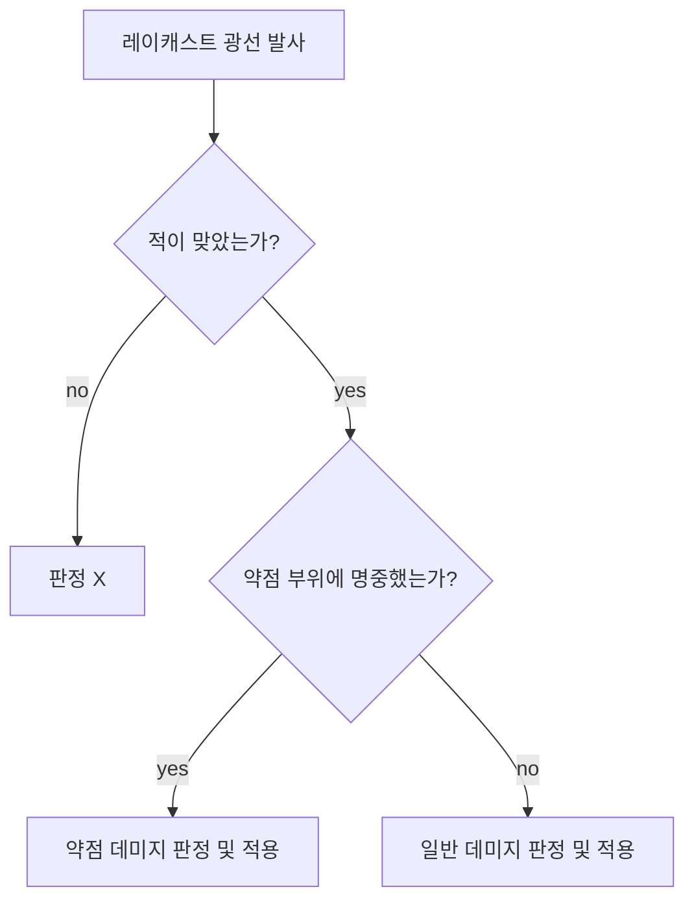

---
aliases:
작성 날짜: 2026-09-30T10:15
작성자:
관여 주체:
  - "[[플레이어 캐릭터]]"
  - "[[적]]"
categories:
  - "[[데미지 시스템(초기 기획)]]"
tags:
  - notes
---
# [[범위형 데미지]]의 경우

```mermaid
flowchart TD

A["데미지 영역(콜라이더) 생성"]
--> B[["패시브 등의 기타 규칙 적용"]]
--> C{"약점 데미지로 인식하는가?"}
-->|yes| D["약점 데미지 판정 및 적용"]
C-->|no| E["일반 데미지 판정 및 적용"]
```
# [[레이캐스트형 데미지]]의 경우

```mermaid
flowchart TD
A["레이캐스트 광선 발사"]
--> B{"적이 맞았는가?"}
B -->|no| C["판정 X"]
B-->|yes| D{"약점 부위에 명중했는가?"}
D -->|yes| E["약점 데미지 판정 및 적용"]
D -->|no| F["일반 데미지 판정 및 적용"]
```
