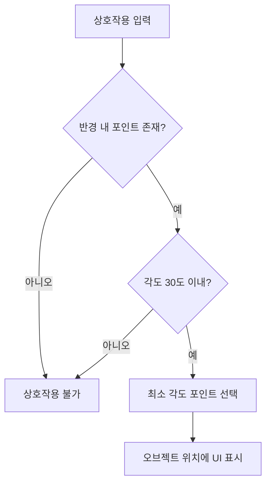

---
aliases:
작성 날짜: 2026-09-29T01:49
작성자:
  - "[[이준호]]"
관여 주체:
  - "[[플레이어 캐릭터]]"
categories:
  - "[[상호작용 시스템 초기 기획]]"
tags:
  - notes
---

```mermaid
flowchart TD
    A["상호작용 입력"] --> B{"반경 내 포인트 존재?"}
    B -->|"아니오"| Z["상호작용 불가"]
    B -->|"예"| C{"각도 30도 이내?"}
    C -->|"아니오"| Z
    C -->|"예"| D["최소 각도 포인트 선택"]
    D --> E["오브젝트 위치에 UI 표시"]
```
