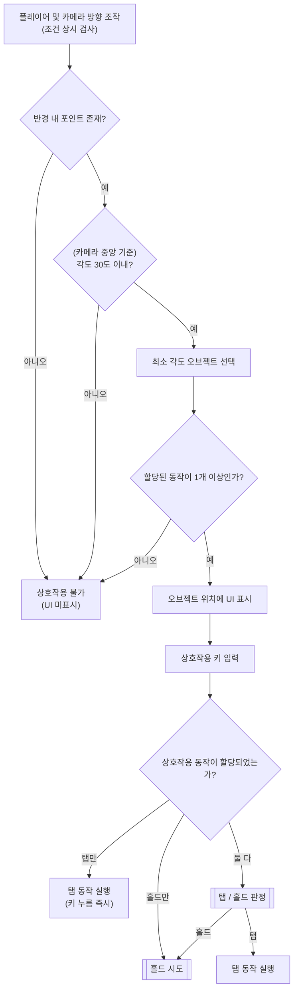

---
aliases:
작성 날짜: 2026-09-29T01:49
작성자:
  - "[[이준호]]"
관여 주체:
  - "[[플레이어 캐릭터]]"
categories:
  - "[[상호작용 시스템(초기 기획)]]"
tags:
  - 문서
---
아래 노드의 `탭 / 홀드 판정`, `홀드 시도`와 관련된 내용은 [[탭과 홀드 플로우차트]] 참조.

```mermaid
flowchart TD
    A["플레이어 및 카메라 방향 조작<br/>(조건 상시 검사)"] --> B{"반경 내 포인트 존재?"}
    B -->|"아니오"| Z["상호작용 불가<br/>(UI 미표시)"]
    B -->|"예"| C{"(카메라 중앙 기준)<br>각도 30도 이내?"}
    C -->|"아니오"| Z
    C -->|"예"| D["최소 각도 오브젝트 선택"]
    D --> M{"할당된 동작이 1개 이상인가?"}
    M -->|"아니오"| Z
    M -->|"예"| E["오브젝트 위치에 UI 표시"]
    E --> IN["상호작용 키 입력"]
    IN --> S{"상호작용 동작이 할당되었는가?"}
    S -->|"탭만"| J["탭 동작 실행<br/>(키 누름 즉시)"]
    S -->|"홀드만"| HO[["홀드 시도"]]
    S -->|"둘 다"| F[["탭 / 홀드 판정"]]
    F -->|"탭"| G["탭 동작 실행"]
    F -->|"홀드"| HO
```
