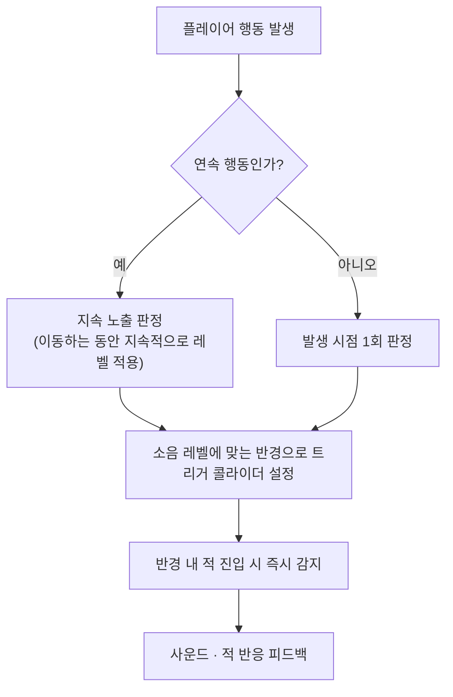

---
aliases:
작성 날짜: 2026-09-29T00:15
작성자:
  - "[[이준호]]"
관여 주체:
  - "[[플레이어 캐릭터]]"
  - "[[적]]"
categories:
  - "[[소음 시스템 초기 기획]]"
tags:
  - notes
---
행동이 발생할 때마다 플레이어에게 존재하는 3D 구형 트리거 콜라이더를 사용해 주변 적들이 플레이어의 위치를 인지할 수 있게 한다. 콜라이더 방식은 하나의 콜라이더를 상황에 크기를 수정해가며 쓰는 방식을 채택한다. 예를 들어, [[앉기]] 상태에서 걷는 중에는 [[소음 레벨]] 1의 [[소음 반경]]을 지정하고, 동시에 총을 쏘는 순간 [[소음 레벨]] 4의 [[소음 반경]]을 적용하는 것이다.

동시에 여러 행동을 하고 있다면, 더 작은 [[소음 레벨]] 요소는 무시하고, 더 큰 [[소음 레벨]]의 반경만 적용하도록 한다.

판정 단위는 다음과 같다. 연속적으로 이루어지는 행동([[앉기]] 상태에서 [[이동]], [[서기]] 상태에서 [[이동]], [[전력 질주]] 등)은 해당 행동을 지속하는 동안 계속해서 적용하지만, 순간적으로 이루어지는 행동(점프, 장전, 사격, 상호작용, 수류탄 폭발 등)은 발생 시점에 1회 판정한다. 적의 감지는 콜라이더 내에 진입한 순간 즉시 감지로 판정하며, 누적 시간은 두지 않는다. 감지 후 플레이어 피드백은 사운드와 적의 반응(시야 전환 / 경계 / 추적 개시)로 제공한다.

