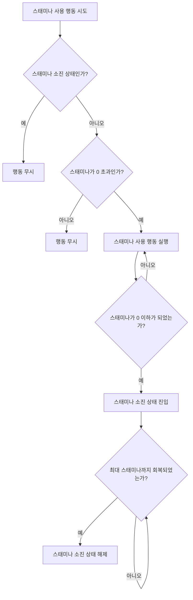

---
aliases:
작성 날짜: 2026-09-28T17:27
작성자:
  - "[[이준호]]"
관여 주체:
  - "[[플레이어 캐릭터]]"
categories:
  - "[[용어]]"
  - "[[플레이어 스테이터스(초기 기획)]]"
tags:
  - notes
---
# [[스태미나]] [[스테이터스]]의 종류

| **항목**                 | **값**           | **비고**                                       |
| ---------------------- | --------------- | -------------------------------------------- |
| [[최대 스태미나]]            | 100             | [[초기 고정값]]                                   |
| [[현재 스태미나]]            | 0 ~ [[최대 스태미나]] | 지속적으로 소모되는 스태미나 양. 실제 남은 스태미나의 양을 추적하기 위한 값임 |
| [[스태미나 회복 지연 시간]]      | 2s              | 스태미나 소모가 멈추면 2초 뒤 회복 시작                      |
| [[스태미나 회복 속도]]         | 12.5/s          | 스태미나 회복 시 초당 회복되는 양                          |
| [[전력 질주]] [[스태미나 소모량]] | 6.67/s          | 스태미나 초당 소모량                                  |
| [[점프]] [[스태미나 소모량]]    | 20/회            | 한 번 점프할 때마다 소모되는 스태미나 양                      |

[[현재 스태미나]]가 0 이하가 되면 [[플레이어 캐릭터]]는 [[스태미나 소진 상태]]에 빠진다.

# 스태미나 사용 절차

