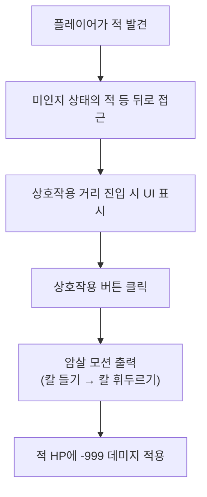

---
aliases:
작성 날짜: 2026-09-29T01:58
작성자:
  - "[[이준호]]"
관여 주체:
  - "[[플레이어 캐릭터]]"
categories:
  - "[[암살 시스템 초기 기획]]"
tags:
  - notes
---
플레이어가 적을 발견한 뒤, 적이 [[플레이어 캐릭터]]를 인지하지 않은 상태에서 천천히 등 뒤로 접근한다. [[상호작용 반경]]에 들어서면 [[상호작용 UI]]가 나타나고, [[상호작용]] 키^[[[플레이어 조작 키]] 문서 참조.]를 누르면 적 [[암살 모션]]이 출력된다. [[암살 모션]]이 끝나면 적 [[HP]]에 `-999` [[데미지]]가 적용된다. 이는 [[처형]] 판정이 아니라 [[데미지]]가 적용되는 방식이며, 대부분의 적은 [[HP]]가 0 이하로 내려가며 사망하는 것을 유도한다.

[[암살 모션]]은 두 단계로 나뉜다:

1. 총을 내리고 칼을 들어올림
2. 칼을 휘두름

굳이 두 단계로 나눈 이유는, 단검 모델링을 사용할 것이라면 이를 [[총검 총기 개조부품]] 아이디어에 써먹을 수 있기 때문이다.

